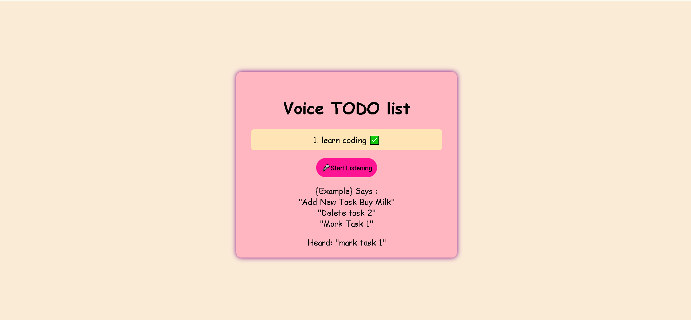

# 🎙️ Voice TODO App

A simple and efficient voice-powered TODO list web application that allows users to add tasks using speech input. Built using **HTML**, **CSS**, and **JavaScript**, the app leverages the **Web Speech API** to enable hands-free task management.

---

## 🚀 Features

- 🎤 Add tasks using voice input
- ✅ Mark tasks as completed
- ❌ Delete tasks with ease
- 💾 Local storage support to save your tasks across sessions
- 🧼 Clean and intuitive UI

---

## 🛠️ Technologies Used

- **HTML5** – Structure of the application
- **CSS3** – Styling and layout
- **JavaScript** – Application logic and DOM manipulation
- **Web Speech API** – Speech recognition
- **Local Storage API** – Persistent task saving

---

## 📸 Screenshot

 <!-- Replace 'voice.png' with your actual screenshot file -->

---

## 📦 How to Run the Project Locally

1. Clone the repository:

    ```bash
    git clone https://github.com/Altafulla4/Voice-TODO-App.git
    ```

2. Navigate to the project directory:

    ```bash
    cd Voice-TODO-App
    ```

3. Open the `index.html` file in your preferred browser:

    - Option 1 (Command Line):

      ```bash
      open index.html   # Mac/Linux
      start index.html  # Windows
      ```

    - Option 2:

      - Double-click the `index.html` file to open in your default browser.

> ⚠️ **Note:** The app works best in modern browsers like **Google Chrome** that support the **Web Speech API**.

---

## 🗣️ How to Use

1. Click the **microphone** button.
2. Speak your task (e.g., _"Add new task Buy groceries"_).
3. The task will automatically appear in your TODO list.
4. Say _"Mark task 1"_ (or the corresponding number) to complete the task ✅.

---


## 🙋‍♂️ Author

**Altafulla Hurkadli**  
- 🔗 [GitHub](https://github.com/Altafulla4)  
- 🔗 [LinkedIn](https://www.linkedin.com/in/altafulla-hurkadli/)

---

## 📜 License

This project is licensed under the **MIT License**.
